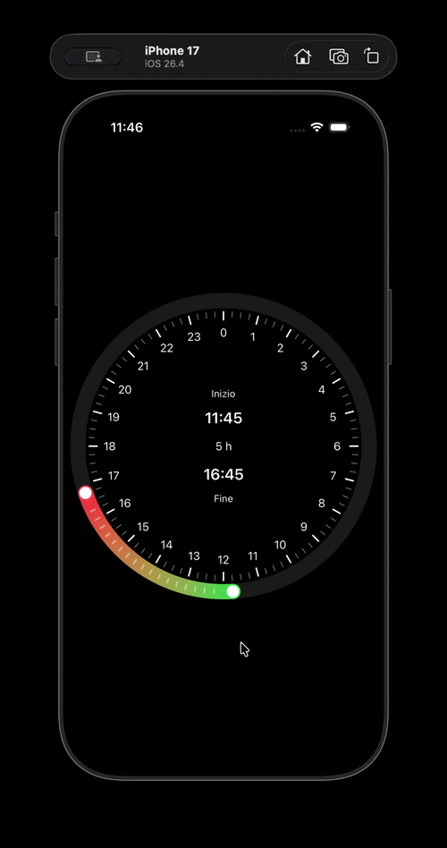
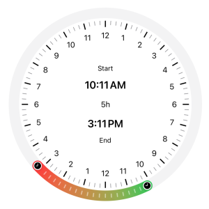
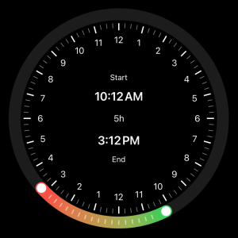
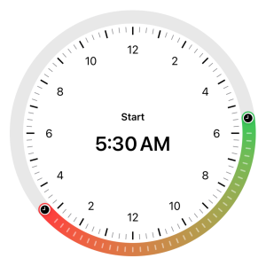
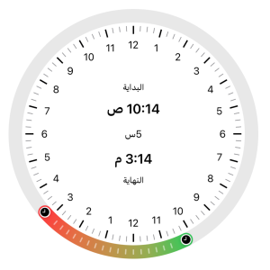

<div align="center">

# Kronot

### A customizable radial time-range picker for SwiftUI

[Italian version](README.it.md)

[](LICENSE)


</div>

**Kronot** is a native SwiftUI control for selecting a **time range on a 24-hour radial dial**.

It is designed for interfaces where a visual slice of the day is clearer than a traditional picker, such as:

- sleep schedules
- availability windows
- focus sessions
- daily routines
- any experience where users should *see* the selected portion of the day

Kronot keeps its public integration surface small while exposing two clear customization layers:

- `Parameters` for behavior and content
- `DesignTokens` for visual styling

---

## Contents

- [Demo](#demo)
- [Preview](#preview)
- [Requirements](#requirements)
- [Installation](#installation)
- [Features](#features)
- [Quick Start](#quick-start)
- [Reading Selected Values](#reading-selected-values)
- [Core Model](#core-model)
- [Interaction Model](#interaction-model)
- [Configuration Overview](#configuration-overview)
- [Localization](#localization)
- [Accessibility](#accessibility)
- [Testing](#testing)
- [Acknowledgments](#acknowledgments)
- [Localization Review](#localization-review)
- [License](#license)

---

## Demo

<p align="center">
  
</p>

---

## Preview

| Default | Dark Mode |
|---|---|
|  |  |

| Action | Localized |
|---|---|
|  |  |

---

## Requirements

Kronot currently requires:

- **iOS 18.0+**
- **Swift 6 mode**
- **Swift tools version 6.3**
- **SwiftUI**

From `Package.swift`:

```swift
// swift-tools-version: 6.3
platforms: [.iOS(.v18)]
swiftLanguageModes: [.v6]
```

---

## Installation

### Xcode

1. Open your project.
2. Go to **File > Add Package Dependencies...**
3. Paste the repository URL.
4. Add the `Kronot` library to your target.

Repository URL:

```text
https://github.com/neographic-fab/Kronot.git
```

### Package.swift

```swift
dependencies: [
    .package(url: "https://github.com/neographic-fab/Kronot.git", branch: "main")
],
targets: [
    .target(
        name: "YourApp",
        dependencies: [
            .product(name: "Kronot", package: "Kronot")
        ]
    )
]
```

Then import it where needed:

```swift
import Kronot
```

---

## Features

- 24-hour radial time-range selection
- draggable start and end thumbs
- draggable active track to shift the whole interval while preserving duration
- configurable snapping behavior
- configurable minimum and maximum active duration
- environment-driven customization through `Parameters` and `DesignTokens`
- localized built-in strings
- locale-aware time formatting
- VoiceOver adjustable actions
- Dynamic Type-aware radial label density
- support for Differentiate Without Color
- haptic feedback during interaction

---

## Quick Start

Kronot works with a `Binding<TimeRange>`.

```swift
import SwiftUI
import Kronot

struct ContentView: View {
    @State private var range: TimeRange = .currentTime(snapHours: 5)

    var body: some View {
        VStack(spacing: 24) {
            Kronot(range: $range)
                .frame(width: 320, height: 320)

            Text("Start: \(range.start.hour):\(String(format: "%02d", range.start.minute))")
            Text("End: \(range.end.hour):\(String(format: "%02d", range.end.minute))")
        }
        .padding()
    }
}
```

---

## Reading Selected Values

Kronot updates the bound `TimeRange` live during interaction.

You can read the selected values directly from the binding:

```swift
let startHour = range.start.hour
let startMinute = range.start.minute

let endHour = range.end.hour
let endMinute = range.end.minute
```

You can also present the selected values in a more user-friendly way, including a formatted duration:

```swift
import SwiftUI
import Kronot

struct ContentView: View {
    @State private var range: TimeRange = .currentTime(snapHours: 5)

    var body: some View {
        VStack(spacing: 24) {
            Kronot(range: $range)
                .frame(width: 320, height: 320)

            VStack(alignment: .leading, spacing: 12) {
                Text("Selected Range")
                    .font(.headline)

                Text("Start: \(formattedTime(range.start))")
                Text("End: \(formattedTime(range.end))")
                Text("Duration: \(formattedDuration(range.durationGoingForwardInMinutes))")
            }
            .frame(maxWidth: 320, alignment: .leading)
        }
        .padding()
    }

    private func formattedTime(_ components: TimeRange.Components) -> String {
       let hour = components.hour
       let minute = String(format: "%02d", components.minute)
       return "\(hour):\(minute)"
    }

    private func formattedDuration(_ minutes: Int) -> String {
        let formatter = DateComponentsFormatter()
        formatter.allowedUnits = [.hour, .minute]
        formatter.unitsStyle = .abbreviated
        formatter.zeroFormattingBehavior = .dropAll

        let seconds = TimeInterval(minutes * 60)
        return formatter.string(from: seconds) ?? "\(minutes) min"
    }
}
```

This is useful when you want to display the selected range elsewhere in your UI, persist it, or map it into your own domain model.

---

## Core Model

Kronot uses `TimeRange` as its main public value type.

```swift
public struct TimeRange: Equatable {
    public var start: Components
    public var end: Components
}
```

`TimeRange.Components` stores:

```swift
public struct Components: Equatable {
    public var hour: Int
    public var minute: Int
}
```

### Create a custom range

```swift
let range = TimeRange(
    start: .init(hour: 22, minute: 0),
    end: .init(hour: 6, minute: 30)
)
```

Ranges that cross midnight are fully supported.

### Create a range from the current time

```swift
let range = TimeRange.currentTime(snapHours: 5)
```

This creates a range starting from the current time and ending `snapHours` later.

---

## Interaction Model

Kronot supports three interaction modes:

1. Drag the **start** thumb
2. Drag the **end** thumb
3. Drag the **active track** to move the whole interval

During interaction, Kronot:

- snaps to the configured step
- preserves wrap-around behavior across midnight
- enforces minimum and maximum active duration
- emits selection haptics

---

## Configuration Overview

Kronot separates configuration into two layers:

- `Parameters` for **behavior and content**
- `DesignTokens` for **visual styling**

Both are applied through view modifiers and injected through the environment.

### Parameters

Use `.parameters { ... }` to configure behavior and content.

```swift
Kronot(range: $range)
    .parameters { parameters in
        parameters.behavior.snapMode = .everyQuarterHour
        parameters.behavior.minActiveHours = 2
        parameters.behavior.maxActiveHours = 12
    }
```

#### Behavior

`Parameters.Behavior` controls:

- `minActiveHours`
- `maxActiveHours`
- `snapMode`

Available snap modes:

```swift
.everyFiveMinutes
.everyTenMinutes
.everyQuarterHour
.everyHalfHour
.everyHour
```

Behavior values are sanitized automatically when injected into the environment.

Current normalization rules:

- `minActiveHours` is clamped to `1...23`
- `maxActiveHours` is clamped to `1...23`
- `minActiveHours` cannot exceed `maxActiveHours`

#### Content

`Parameters.Content` controls:

- radial labels
- readout accessories

##### Radial labels

```swift
Kronot(range: $range)
    .parameters { parameters in
        parameters.content.radialLabels.showMeridiem = true
        parameters.content.radialLabels.frequency = .everyTwoHours
    }
```

Available frequencies:

```swift
.everyHour
.everyTwoHours
.cardinal
```

##### Readout accessories

Kronot can show an accessory for the start and end readouts.

Available accessory types:

```swift
.none
.text(LocalizedStringResource)
.verbatim(String)
.icon(systemName: String)
```

Example:

```swift
Kronot(range: $range)
    .parameters { parameters in
        parameters.content.readout.start = .icon(systemName: "moon.fill")
        parameters.content.readout.end = .icon(systemName: "sun.max.fill")
    }
```

### DesignTokens

Use `.designTokens { ... }` to customize visuals.

```swift
Kronot(range: $range)
    .designTokens { tokens in
        tokens.track.lineWidth = 24
        tokens.tick.inset = 6
    }
```

Design tokens are grouped into:

- `track`
- `tick`
- `radialLabels`
- `thumb`
- `readouts`

#### Track

`DesignTokens.TrackTokens` controls line width, inset, line cap, marker visibility, and the drawing style of the base track and selected range.

Example:

```swift
Kronot(range: $range)
    .designTokens { tokens in
        tokens.track.lineWidth = 24
        tokens.track.inset = 12
        tokens.track.showMarker = true
        tokens.track.markerLengthFactor = 0.35
        tokens.track.setStyle(.solid(.secondary.opacity(0.15)), for: .base)
        tokens.track.setStyle(.angular(.green, .yellow, .orange), for: .range)
    }
```

Track values are sanitized automatically. For example:

- `lineWidth` is clamped to a safe range
- `inset` cannot be negative
- marker values are normalized to valid limits

#### Tick

`DesignTokens.TickTokens` controls major and minor tick appearance.

```swift
Kronot(range: $range)
    .designTokens { tokens in
        tokens.tick.major.length = 14
        tokens.tick.major.width = 2
        tokens.tick.minor.length = 8
        tokens.tick.minor.width = 1
        tokens.tick.inset = 4
    }
```

#### Radial Labels

`DesignTokens.RadialLabelsTokens` controls label inset, color, and font.

```swift
Kronot(range: $range)
    .designTokens { tokens in
        tokens.radialLabels.inset = 18
        tokens.radialLabels.color = .secondary
        tokens.radialLabels.font = .footnote
    }
```

#### Thumb

`DesignTokens.ThumbTokens` lets you style the start and end thumbs independently.

Each thumb can configure, among other things:

- fill color
- icon visibility
- icon name
- icon color
- scale
- shadow

```swift
Kronot(range: $range)
    .designTokens { tokens in
        tokens.thumb.start.color = .white
        tokens.thumb.start.iconSystemName = "moon.fill"
        tokens.thumb.end.color = .white
        tokens.thumb.end.iconSystemName = "sun.max.fill"
        tokens.thumb.end.scale = .medium
    }
```

#### Readouts

`DesignTokens.ReadoutsTokens` controls typography and color for start, end, duration, and accessory readouts, including focused and idle states where available.

```swift
Kronot(range: $range)
    .designTokens { tokens in
        tokens.readouts.start.idle.font = .title3
        tokens.readouts.start.focused.font = .title
        tokens.readouts.end.focused.color = .primary
        tokens.readouts.duration.color = .secondary
        tokens.readouts.accessory.focused.fontWeight = .semibold
    }
```

---

## Full Example

```swift
import SwiftUI
import Kronot

struct DemoView: View {
    @State private var range = TimeRange(
        start: .init(hour: 22, minute: 0),
        end: .init(hour: 6, minute: 0)
    )

    var body: some View {
        Kronot(range: $range)
            .frame(width: 320, height: 320)
            .parameters { parameters in
                parameters.behavior.snapMode = .everyQuarterHour
                parameters.behavior.minActiveHours = 2
                parameters.behavior.maxActiveHours = 12
                parameters.content.radialLabels.showMeridiem = true
                parameters.content.radialLabels.frequency = .everyTwoHours
                parameters.content.readout.start = .icon(systemName: "moon.stars.fill")
                parameters.content.readout.end = .icon(systemName: "sun.max.fill")
            }
            .designTokens { tokens in
                tokens.track.lineWidth = 24
                tokens.track.inset = 10
                tokens.track.setStyle(.solid(.secondary.opacity(0.15)), for: .base)
                tokens.track.setStyle(.angular(.indigo, .purple, .pink), for: .range)
                tokens.track.markerColor = .white.opacity(0.7)
                tokens.tick.major.color = .primary
                tokens.tick.minor.color = .secondary
                tokens.thumb.start.iconSystemName = "moon.fill"
                tokens.thumb.end.iconSystemName = "sun.max.fill"
                tokens.radialLabels.font = .footnote
            }
            .padding()
    }
}
```

---

## Localization

Kronot is configured with:

```swift
defaultLocalization: "en"
```

The package includes a string catalog with built-in localized resources for labels and accessibility text.

Current bundled localizations:

- Arabic (`ar`)
- German (`de`)
- English (`en`)
- Spanish (`es`)
- French (`fr`)
- Hebrew (`he`)
- Hindi (`hi`)
- Indonesian (`id`)
- Italian (`it`)
- Japanese (`ja`)
- Korean (`ko`)
- Dutch (`nl`)
- Polish (`pl`)
- Brazilian Portuguese (`pt-BR`)
- Romanian (`ro`)
- Russian (`ru`)
- Thai (`th`)
- Turkish (`tr`)
- Ukrainian (`uk`)
- Vietnamese (`vi`)
- Simplified Chinese (`zh-Hans`)
- Traditional Chinese (`zh-Hant`)

Kronot also adapts formatting through locale-aware time output.

---

## Accessibility

Kronot includes accessibility support for:

- VoiceOver adjustable actions for start and end values
- localized accessibility labels
- Dynamic Type-aware radial label density
- Differentiate Without Color support for marker visibility

---

## Testing

Kronot includes a focused test suite for its core logic and formatter behavior.

Current coverage includes:

- time range duration calculations
- wrap-around behavior across midnight
- minute normalization and wrapped deltas
- snap rounding behavior
- minimum and maximum active duration constraints
- pure range interaction logic
- localized formatter behavior for radial labels, time text, and duration text

Run the test suite with:

```bash
swift test
```

---

## Acknowledgments

Kronot was shaped with the support of people who generously helped during development:

- **Artem Mirzabekian**  
  LinkedIn: https://www.linkedin.com/in/artem-mirzabekian/  
  GitHub: https://github.com/Livsy90  
  Artem provided valuable support during development and was especially helpful during the VoiceOver implementation.

- **Andrei Ilnitskii**  
  LinkedIn: https://www.linkedin.com/in/andreiilnitskii/  
  GitHub: https://github.com/indieupme  
  Andrei played a key role in the localization work, with especially important support for the Russian localization.

- **Hemant Bhadak**  
  LinkedIn: https://www.linkedin.com/in/hemant-bhadak/  
  GitHub: https://github.com/hemant89  
  Hemant provided important support for the Hindi localization.

---

## Localization Review

Additional localization review was provided by native speakers for:

- Simplified Chinese
- Traditional Chinese
- Romanian
- Arabic

These reviews were provided privately by native speakers who are not publicly listed here.

---

## License

Kronot is released under the **MIT License**.  
See the [LICENSE](LICENSE) file for details.
